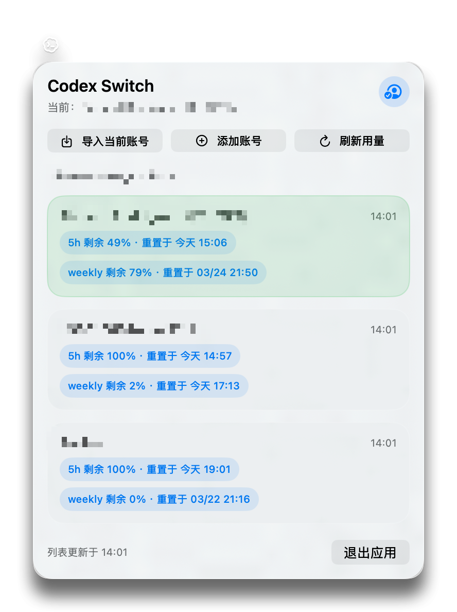

# Codex Switch

[English](./README.md) | [简体中文](./README.zh-CN.md)

`Codex Switch` 是一个 macOS 菜单栏应用，适合需要在多个 Codex 或 ChatGPT 账号之间频繁切换的人使用。

## 应用简介

Codex Switch 可以帮助你在菜单栏里管理多个本地 Codex 登录配置。

你不需要再手动替换 auth 文件，就可以：

- 导入当前账号
- 保存多个账号快照
- 一键切换当前生效账号
- 查看最近的用量信息
- 给工作区添加更容易辨认的名称

## 主要功能

- 轻量的 macOS 菜单栏体验
- 一键切换账号
- 本地保存账号快照
- 快速导入当前已登录账号
- 从 ChatGPT 用量接口刷新信息
- 支持为工作区设置别名

## 典型使用方式

1. 先在你的 Mac 上登录 Codex
2. 在 Codex Switch 中导入当前账号
3. 对其他需要保留的账号重复这个过程
4. 之后随时通过菜单栏应用切换账号

## 适合谁使用

如果你符合下面这些情况，这个应用会比较有帮助：

- 你有多个 Codex 账号
- 你需要在个人账号和团队工作区之间切换
- 你不想再手动改 auth 文件
- 你更喜欢桌面工具而不是命令行脚本

## 说明

- 仅支持 macOS
- 依赖你本机上的本地 Codex 登录数据
- 与 OpenAI 无官方关联

## 开源说明

这个项目是一个面向 Codex 用户的本地效率工具，并以开源形式发布。
